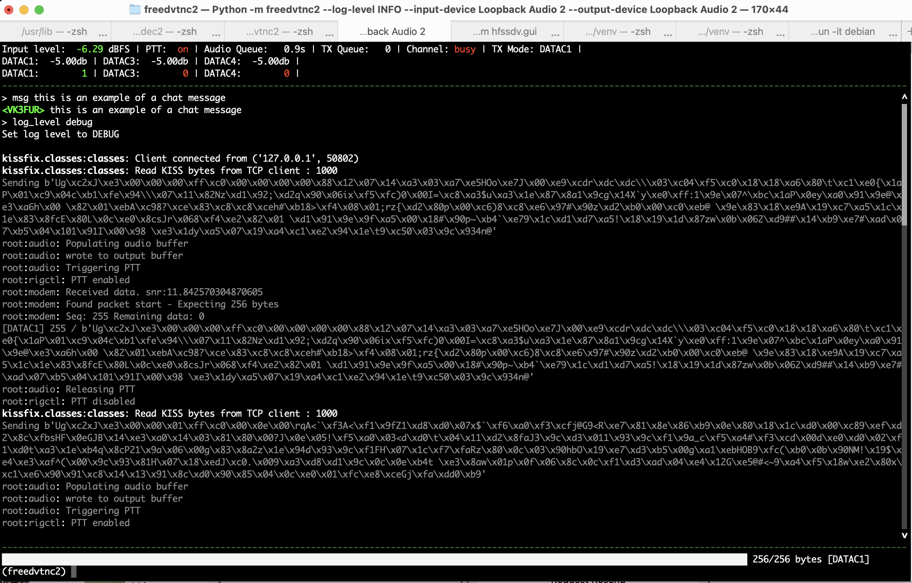

A KISS TNC using the freedv data modems.



## Features
 - KISS interface (virtual serial, or TCP)
 - Chat
 - DATAC1, DATAC3 and DATAC4 modes

## Unsupported
 - Windows

## Requirements
 - hamlib
 - portaudio / pyaudio
 - c build tools

## Install

Instructions for a raspberrypi. Requires bookworm or python 3.11 to be installed.

```sh
# install required system packages
sudo apt-get update
sudo apt install git build-essential cmake portaudio19-dev python3 python3-dev libhamlib-utils

sudo apt install pipx
pipx ensurepath

# make sure the PATH is set correctly
source ~/.profile

# install codec2 (the debian packaged versions do not contain DATAC4 modem)
git clone https://github.com/drowe67/codec2.git
cd codec2
mkdir build_linux
cd build_linux
cmake ..
make
sudo make install
sudo ldconfig

# install freedvtnc2
pipx install freedvtnc2


```

If libcodec2 is installed somewhere else you can use `CFLAGS="-I/path/to/headers/ -L/path/to/lib/"` during to ensure that we can find libcodec2 during the install

## Running
```
# Run rigctld in background. See rigctld --help on how to configure your rig
rigctld -m 1 -r /dev/null &

# Test to make sure rigctl works
rigctl -m 2 T 1 # enable PTT
rigctl -m 2 T 0 # disable PTT

# Get argument help
freedvtnc2 --help

#list audio devices
freedvtnc2 --list-audio-devices

freedvtnc2 --output-device 0 --input-device 0 --log-level DEBUG # it's useful to have debug turned on when first testing
```

The connect your favorite kiss tools up to the TNC over TCP port 8001 or PTS interface if enabled

## Testing

The CLI has a handy `test_ptt` to make test that PTT and sound output is working.

## Command line arguments
```
usage: freedvtnc2 [-h] [-c C] [--no-cli] [--list-audio-devices] [--log-level {CRITICAL,FATAL,ERROR,WARN,WARNING,INFO,DEBUG,NOTSET}] [--input-device INPUT_DEVICE] [--output-device OUTPUT_DEVICE]
                  [--output-volume OUTPUT_VOLUME] [--mode {DATAC1,DATAC3,DATAC4}] [--follow] [--max-packets-combined MAX_PACKETS_COMBINED] [--pts] [--kiss-tcp-port KISS_TCP_PORT]
                  [--kiss-tcp-address KISS_TCP_ADDRESS] [--rigctld-port RIGCTLD_PORT] [--rigctld-host RIGCTLD_HOST] [--ptt-on-delay-ms PTT_ON_DELAY_MS] [--ptt-off-delay-ms PTT_OFF_DELAY_MS]
                  [--callsign CALLSIGN]

options:
  -h, --help            show this help message and exit
  -c C, -config C       config file path
  --no-cli              [env var: FREEDVTNC2_CLI]
  --list-audio-devices
  --log-level {CRITICAL,FATAL,ERROR,WARN,WARNING,INFO,DEBUG,NOTSET}
                        [env var: FREEDVTNC2_LOG_LEVEL]
  --input-device INPUT_DEVICE
                        [env var: FREEDVTNC2_INPUT_DEVICE]
  --output-device OUTPUT_DEVICE
                        [env var: FREEDVTNC2_OUTPUT_DEVICE]
  --output-volume OUTPUT_VOLUME
                        in db. postive = louder, negative = quiter [env var: FREEDVTNC2_OUTPUT_DB]
  --mode {DATAC1,DATAC3,DATAC4}
                        The TX mode for the modem. The modem will receive all modes at once
  --follow              When enabled change TX mode to the mode being received. This is useful for stations operating automatically. [env var: FREEDVTNC2_FOLLOW]
  --max-packets-combined MAX_PACKETS_COMBINED
                        How many kiss packets to combine into a single transmission [env var: FREEDVTNC2_MAX_PACKETS]
  --pts                 Disables TCP and instead creates a PTS 'fake serial' interface [env var: FREEDVTNC2_PTS]
  --kiss-tcp-port KISS_TCP_PORT
                        [env var: FREEDVTNC2_KISS_TCP_PORT]
  --kiss-tcp-address KISS_TCP_ADDRESS
                        [env var: FREEDVTNC2_KISS_TCP_ADDRESS]
  --rigctld-port RIGCTLD_PORT
                        TCP port for rigctld - set to 0 to disable rigctld support [env var: FREEDVTNC2_RIGTCTLD_PORT]
  --rigctld-host RIGCTLD_HOST
                        Host for rigctld [env var: FREEDVTNC2_RIGTCTLD_HOST]
  --ptt-on-delay-ms PTT_ON_DELAY_MS
                        Delay after triggering PTT before sending data [env var: FREEDVTNC2_PTT_ON_DELAY_MS]
  --ptt-off-delay-ms PTT_OFF_DELAY_MS
                        Delay after sending data before releasing PTT [env var: FREEDVTNC2_PTT_OFF_DELAY_MS]
  --callsign CALLSIGN   Currently only used for chat [env var: FREEDVTNC2_CALLSIGN]

Args that start with '--' can also be set in a config file (~/.freedvtnc2.conf or specified via -c). Config file syntax allows: key=value, flag=true, stuff=[a,b,c] (for details, see syntax at
https://goo.gl/R74nmi). In general, command-line values override environment variables which override config file values which override defaults.
```

## CLI commands
```
FreeDVTNC2 Help^
---------------
callsign
   Sets callsign - example: callsign N0CALL
clear
   Clears TX queues
debug
   Open the debug shell
exception
   Raises and exemption to test the shell
exit
   Exits FreeDVTNC2
follow
   Allows the tx modem to change to the mode last received - follow on
help
   This help
list_audio_devices
   Lists audio device parameters
log_level
   Set the log level
max_packets_combined
   Set the max number of packets to combine together for a single transmission
mode
   Change TX Mode: mode [DATAC1, DATAC3, DATAC4]
msg
   Send a message
save_config
   Save a config file to ~/.freedvtnc2.conf. Warning this will override your current config
send_string
   Sends string over the modem
test_ptt
   Turns on PTT for 2 seconds
volume
   Set the volume gain in db for output level - you probably want to use soundcard configuration or radio configuration rather than this.

```

Credits
--
David Rowe and the FreeDV team for developing the modem and libraries 